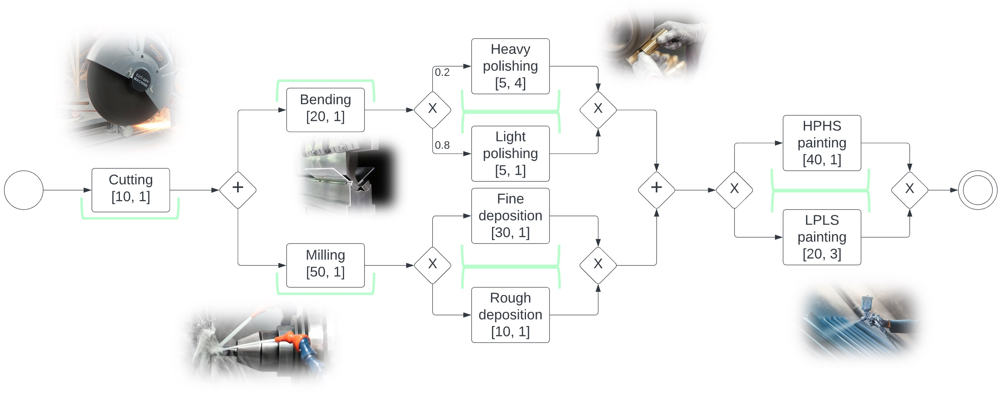

# PACO 
## A strategy founder for *BPMN + CPI* 

## Description

In the context of increasingly complex business processes, accurately modeling decision points, their probabilities, and resource utilization is essential for optimizing operations. To tackle this challenge, we propose an extension to the Business Process Model and Notation (BPMN) called BPMN+CPI. This extension incorporates choices, probabilities, and impacts, emphasizing precise control in business process management. Our approach introduces a timeline-based semantics for BPMN+CPI, allowing for the analysis of process flows and decision points over time. Notably, we assume that all costs, energies, and resources are positive and exhibit additive characteristics, leading to favorable computational properties. Real-world examples demonstrate the role of probabilistic decision models in resource management. Additionally, we’ve developed a tool that assesses strategy existence based on a timeline-encoded process and a specified threshold

### Solver
PACO is an algorithm that given a *BPMN + CPI*  diagram and a bound impact vector can determine if there exists a feasible strategy such that the process can be completed while remaining under the bound vector.



## Installation

To install PACO, you need to download the folder, install the required python packages that can be found in the requirements.txt file.

## Usage

To use PACO, you can  follow these steps:
1. Open a terminal or command prompt window.
2. Navigate to the directory containing the unzipped folder.
3. Run the Python script named "app.py" using the following syntax: 
    ```bash
        python3 .\app.py
    ```
4. Open Chrome (or any othe  browser supporting HTML5) and go to `http://127.0.0.1:8050`.

NB! This application is currently under development. There may be some issues and bugs.

## Authors

* **prof. Sala Pietro**
* **Chini Emanuele**
* **Simonetti Andrea**
* **Zare Omid**

## Contributing

If you want to contribute to PACO, you can create your own branch and start programming.

## License

PACO is licensed under MIT license.